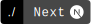
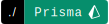

# Hi, I'm Samuel 👋

📍 **Paris ↔ France** | ⌨️ **Développeur Fullstack**

Développeur fullstack TypeScript, mes projets personnels sont visibles sur [samuelprigent.com](https://www.samuelprigent.com). Expérience dans le secteur médico-social sur des problématiques de sécurité (RGPD, ISO 27001). Actuellement chez Groupe Cola, je développe des extranets d'automatisation des ouvertures de compte avec signature électronique et OCR pour les 4 sociétés du groupe.

### Technologies

<!--
<table><tr>
<td></td>
<td></td>
<td></td>
<td></td>
<td></td>
<td></td>
<td></td>
<td></td>
<td></td>
</tr></table>
-->

### Projets

- 🎸 **[Poplist](https://poplist.me)** - Créez, partagez et explorez des listes de films et séries entre amis
- ⌨️ **[pass-strength-indicator](https://pass-strength-indicator.vercel.app/)** - Module npm (React + Tailwind) d'indicateur de robustesse de mot de passe
- 🧢 **[Portfolio](https://www.samuelprigent.com)** - Portfolio personnel avec projets et réalisations

---

### Me contacter

